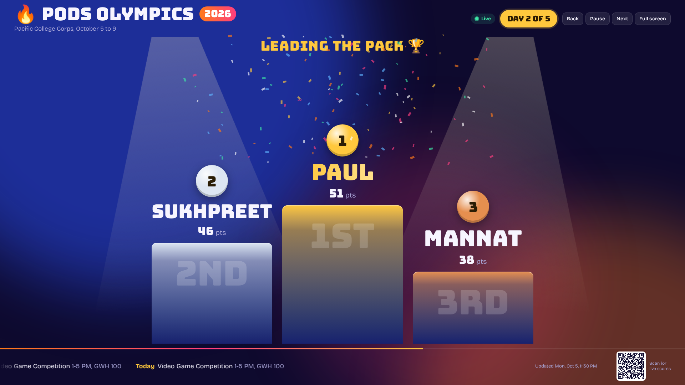
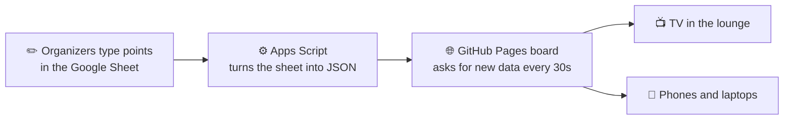

# 🏅 PODS Olympics Live Leaderboard

**A live, animated scoreboard for Pacific College Corps' PODS Olympics, powered by a Google Sheet.**

Organizers type points into a spreadsheet. Every phone, laptop, and TV with the link updates within 30 seconds. No logins, no app installs, no redeploying, and it's built to be reused year after year by whoever runs the event next.

### 👉 [**View the live leaderboard**](https://paul0o7.github.io/pods-leaderboard/)



<sub>Screenshot shows sample scores.</sub>

---

## What is PODS Olympics?

PODS Olympics is a week-long competition between the PODS (small groups) of [Pacific College Corps](https://www.pacific.edu/) at the University of the Pacific in Stockton, CA. Over five days, PODS compete in events like pumpkin painting, a canned food castle build, video game tournaments, a relay race, a scavenger hunt, a costume contest, and a volleyball tournament.

This board gives the whole cohort one place to follow the standings, up on a TV in the lounge or on their own phones.

## Features

- **Animated podium reveal.** Spotlights sweep, an announcer line calls out 3rd, then 2nd, then "And in 1st place...", medals drop in, points count up, and confetti bursts for the leader.
- **Race-lane standings.** Every PODS gets a lane. Bars fill to their score, and the lanes slide from yesterday's order into today's so you can watch teams pass each other.
- **Movement arrows.** ▲ and ▼ show who climbed or dropped since the day before, calculated automatically.
- **Event winners.** Cards showing the top three in each event that's been scored.
- **Live updates.** The board checks the sheet every 30 seconds and pops a "Scores updated" banner when anything changes.
- **Today's schedule ticker.** A scrolling bar with today's events, times, and locations, pulled from the sheet.
- **Scan to follow.** A QR code on big screens so people in the room can open the board on their phones.
- **Works anywhere.** TV, laptop, or phone, with a mobile layout and support for reduced-motion settings.

## How it works



The project is split into two pieces:

| Piece | Where it lives | What it does |
| --- | --- | --- |
| **The data** | A Google Sheet with an Apps Script | Holds the settings, schedule, PODS names, and scores. The script serves them as JSON. |
| **The display** | This repo, on GitHub Pages | A single HTML page that fetches the JSON and renders the animated board. |

The page on GitHub never changes during the event. Only the sheet does. Think of GitHub as the TV and the sheet as the channel.

### Why not just host it on Google?

The first version was served straight from Google Apps Script. It worked in incognito and on phones but showed **"Sorry, unable to open the file at this time"** for anyone signed into more than one Google account, which is a long-standing Apps Script bug. Moving the display to GitHub Pages and fetching the data without cookies (`credentials: "omit"`) sidesteps it completely, so the board opens for everyone.

## Built to be reused

Everything that changes from year to year lives in the spreadsheet, not the code:

| Sheet tab | What you edit |
| --- | --- |
| **Settings** | Title, year, organization, Day 1 date, number of days, leaderboard link |
| **Schedule** | One row per event: day, time, location, notes, and whether it earns points |
| **Scores** | PODS leader names across the top, events down the side, points in the grid |

A custom **🏅 PODS Olympics** menu in the sheet handles the yearly reset. **Start a new season** archives last year's scores to their own tab, clears the points, and bumps the year. The link stays the same every year.

## Repo contents

```
pods-leaderboard/
├── index.html                          The live board (served by GitHub Pages)
├── apps-script/
│   ├── Code.gs                         Reads the sheet, serves JSON, adds the sheet menu
│   └── Index.html                      Backup version of the board served by Google
├── template/
│   └── PODS_Olympics_Live_Leaderboard.xlsx   Starter workbook with setup instructions
├── screenshot.png
├── LICENSE
└── README.md
```

## Run your own

1. **Make the sheet.** Upload the template workbook to Google Drive and save it as a Google Sheet. Edit the Settings, Schedule, and Scores tabs for your event.
2. **Add the script.** In the sheet, open **Extensions > Apps Script**. Paste in `Code.gs`, and add an HTML file named `Index` with the contents of `apps-script/Index.html`.
3. **Deploy it.** Click **Deploy > New deployment > Web app**, with *Execute as: Me* and *Who has access: Anyone*. Copy the link that ends in `/exec`.
4. **Point the board at it.** Fork this repo, open `index.html`, and paste your `/exec` link into the line marked `The only line to change`.
5. **Turn on GitHub Pages.** Go to **Settings > Pages**, pick the `main` branch and `/(root)` folder, and save.
6. **Share the link.** Paste your GitHub Pages link into the Leaderboard link row on the Settings tab so the QR code and sheet menu use it.

Full step-by-step instructions are on the **Start Here** tab of the template workbook.

> **Heads up:** when you change the Apps Script code, update the existing deployment with **Deploy > Manage deployments > ✏️ > New version**. Clicking **New deployment** creates a new link and the board will stop finding its data.

## Tech

- Plain HTML, CSS, and JavaScript. No framework and no build step.
- Google Sheets and Google Apps Script as a free backend.
- GitHub Pages for hosting.
- Canvas confetti, CSS animations, and FLIP-style lane reordering.
- [qrcodejs](https://github.com/davidshimjs/qrcodejs) for the QR code.
- [Bungee](https://fonts.google.com/specimen/Bungee) and [Bricolage Grotesque](https://fonts.google.com/specimen/Bricolage+Grotesque) from Google Fonts.

## Credits

Created by **Paul Consuelo-Valencia**, PODS Leader with Pacific College Corps, University of the Pacific.

[LinkedIn](https://linkedin.com/in/paul-consuelo) · [GitHub](https://github.com/Paul0o7)
